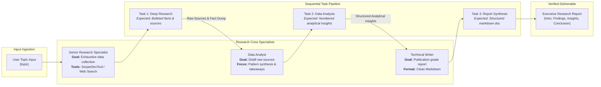
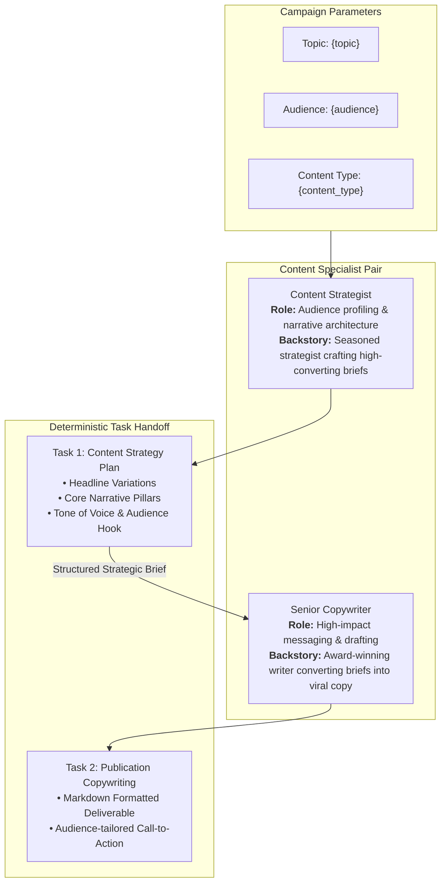
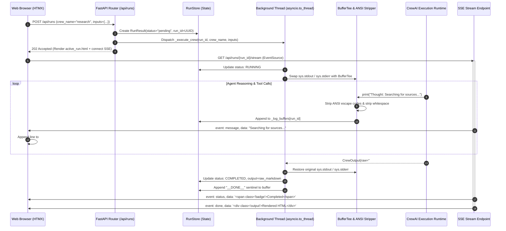

# CrewAI Studio — Enterprise Visual Multi-Agent Runtime & Studio

[](https://www.python.org/)
[](https://crewai.com)
[](https://fastapi.tiangolo.com/)
[](https://htmx.org/)
[](https://aistudio.google.com/)
[](#)
[](#)
[](#)
[](https://opensource.org/licenses/MIT)

> **Engineering Design Document & Production Architecture Showcase**  
> **Author:** Ishan Dhiman ([@BigBro2454](https://github.com/BigBro2454))  
> **Target Alignment:** Multi-Agent Systems Architecture / Google Cloud AI / Enterprise Autonomous Systems  
> **Repository:** [github.com/BigBro2454/crewai-studio](https://github.com/BigBro2454/crewai-studio)  
> **API Documentation:** `http://localhost:8000/api/docs` (OpenAPI / Swagger UI)

---

## 1. Executive Summary & Systems Problem Statement

While multi-agent orchestration frameworks like **CrewAI** enable complex reasoning workflows through specialized role delegation, taking multi-agent swarms from local terminal scripts to **resilient, observable enterprise applications** introduces severe operational bottlenecks:

1. **The "Black-Box Execution" Trap:** Typical multi-agent scripts execute synchronously in CLI environments. In a web runtime, a blocking agent run starves the event loop, offers zero visibility into intermediate thought loops, and fails to provide incremental feedback to users during 60+ second inference sequences.
2. **Brittle Agent Task Handoffs:** Without formal schema validation and deterministic task definitions, sequential agent chains suffer from context drift, hallucinated prerequisites, and unrecoverable downstream degradation.
3. **Vendor Lock-in & Provider Homogeneity:** Real-world enterprise systems demand heterogeneous LLM backends—leveraging fast, cost-effective models (e.g., **Google Gemini 2.5 Flash**) for high-volume data retrieval, alongside specialized reasoning models (e.g., Claude 3.5 Sonnet or GPT-4o) for high-stakes copywriting.
4. **Log Fragmentation & Telemetry:** Capturing raw standard output and formatting terminal escape codes (ANSI color sequences) into lightweight, web-safe real-time telemetry requires safe stream redirection without risking process deadlock.

**CrewAI Studio** addresses these challenges by providing an asynchronous, production-grade visual runtime built with **FastAPI**, **CrewAI**, **HTMX**, and **Tailwind CSS**. It decouples long-running multi-agent execution onto isolated worker threads, intercepts stdout via an in-memory `BufferTee` ring, and streams real-time agent reasoning steps to modern web clients via **Server-Sent Events (SSE)**.

---

## 2. High-Level Systems Architecture

The platform architecture cleanly decouples client interactions, API orchestration, in-memory state tracking, and background multi-agent execution:

```mermaid
graph TB
    subgraph ClientLayer["Client & Visual Workspace (HTMX + Tailwind)"]
        UI_Dash["Dashboard View<br/>(/)"]
        UI_Crew["Crew Studio & Runner<br/>(/crews/{name})"]
        UI_Runs["Live Run Monitor & History<br/>(/runs)"]
        SSE_Client["HTMX SSE Extension<br/>(hx-ext='sse')"]
    end

    subgraph APILayer["FastAPI Gateway & Dispatcher"]
        HTTP_Router["REST & Page Routers<br/>(FastAPI / Jinja2)"]
        BackgroundMgr["Async BackgroundTasks<br/>(Non-blocking Task Spawner)"]
        SSE_Endpoint["SSE Stream Endpoint<br/>(/api/runs/{id}/stream)"]
    end

    subgraph StateLayer["Dual-Layer Persistence & Buffer Management"]
        RunStore["RunStore State Engine<br/>(SQLite data/runs.db + In-Memory LRU Cache)"]
        Exporter["RunExporter Engine<br/>(Structured JSON & L5 Markdown Reports)"]
        LogBuffer["Log Ring Buffer<br/>(_log_buffers[run_id] -> Persisted Logs)"]
        BufferTee["BufferTee Stream Interceptor<br/>(ANSI Stripper + Stdout Tap)"]
    end

    subgraph AgentRuntime["CrewAI Execution Core (Background Worker Thread)"]
        CrewEngine["Crew Runtime Engine<br/>(asyncio.to_thread)"]
        ProcessEngine["Sequential / Hierarchical Process"]
        AgentFleet["Specialized Agent Fleet<br/>(Role, Goal, Backstory)"]
        TaskDAG["Task Execution Pipeline<br/>(Context Passing & Evaluation)"]
    end

    subgraph IntelligenceLayer["Multi-Provider LLM Factory"]
        Factory["LLM Factory<br/>(backend.config.llm_factory)"]
        GeminiLLM["Google Gemini<br/>(gemini-2.5-flash / gemini-1.5-pro)"]
        AnthropicLLM["Anthropic<br/>(claude-3-5-sonnet)"]
        OpenAILLM["OpenAI<br/>(gpt-4o)"]
    end

    subgraph ToolingLayer["Integrated Agent Tools"]
        SerperTool["SerperDevTool<br/>(Google Search API)"]
        BrowserTool["Browserless<br/>(Headless Web Scraper)"]
    end

    %% Wiring
    UI_Dash --> HTTP_Router
    UI_Crew --> HTTP_Router
    UI_Runs --> HTTP_Router
    UI_Crew -->|POST /api/runs (Form/JSON)| HTTP_Router

    HTTP_Router --> BackgroundMgr
    BackgroundMgr -->|Spawn async thread| CrewEngine
    HTTP_Router --> RunStore

    SSE_Client -->|EventSource GET| SSE_Endpoint
    SSE_Endpoint --> LogBuffer
    SSE_Endpoint --> RunStore

    CrewEngine --> ProcessEngine
    ProcessEngine --> AgentFleet
    AgentFleet --> TaskDAG
    TaskDAG --> ToolingLayer

    CrewEngine --> BufferTee
    BufferTee --> LogBuffer

    AgentFleet --> Factory
    Factory --> GeminiLLM
    Factory --> AnthropicLLM
    Factory --> OpenAILLM
```

---

## 3. CrewAI Multi-Agent Hierarchy Blueprints

### Blueprint A: Research Crew (3-Tier Specialist Pipeline)
Designed for deep investigative synthesis, this crew employs a strict separation of concerns across discovery, qualitative analysis, and publication:



---

### Blueprint B: Content Strategy Crew (Collaborative Brief & Copywriting)
Optimized for multi-format marketing generation, aligning strategic audience personas with tailored copy:



---

### Sequence C: Non-Blocking SSE Streaming & Output Rendering Lifecycle
Demonstrates how raw standard output generated inside deep CrewAI worker threads is captured, sanitized, streamed, and rendered:



---

## 4. Crew Specifications & Task Execution Matrix

| Crew Identifier | Specialist Agent | Model Role & Goal | Assigned Task & Expected Output | Environmental Tools |
| :--- | :--- | :--- | :--- | :--- |
| **`research`** | **Senior Research Specialist** | Find comprehensive, fact-checked data on `{topic}`. | **`research_task`**: Bullet-point summary of key facts, historical precedents, and sources. | `SerperDevTool` (Google Search) |
| | **Data Analyst** | Analyze findings, identify quantitative trends, and extract key takeaways. | **`analysis_task`**: Analytical breakdown with numbered insights and cross-domain implications. | None (Pure Reasoning) |
| | **Technical Writer** | Synthesize complex findings into an executive-ready report. | **`writing_task`**: Polished Markdown document with executive summary, findings, and conclusion. | Markdown Parser |
| **`content`** | **Content Strategist** | Architect a strategic content brief for `{topic}` targeting `{audience}`. | **`strategy_task`**: Outline with headline variants, core messaging pillars, and recommended tone. | None (Strategic Analysis) |
| | **Senior Copywriter** | Produce publication-ready `{content_type}` matching the strategy brief. | **`writing_task`**: Final draft complete with audience hooks and formatted calls-to-action. | Markdown Formatter |

---

## 5. L5 Systems & Architectural Trade-off Matrix

| Architecture Dimension | Strategy A | Strategy B | Selected Recommendation & Production Rationale |
| :--- | :--- | :--- | :--- |
| **Agent Process Model** | **Sequential Execution (`Process.sequential`)**<br/>• Deterministic data flow<br/>• High predictability<br/>• Linear latency $O(N)$ | **Hierarchical Swarm (`Process.hierarchical`)**<br/>• Dynamic manager delegation<br/>• Higher reasoning autonomy<br/>• Risk of delegation loops & extra LLM overhead | **Sequential by Default**: Guarantees deterministic task pipelines for research and content generation while eliminating infinite delegation loops. |
| **Telemetry Interception** | **Direct Stdout Tap (`BufferTee`)**<br/>• Zero framework changes<br/>• Universal support for all third-party libraries | **Structured Event Bus (OpenTelemetry)**<br/>• Strict event schemas<br/>• Requires custom SDK hooks across all agent internals | **Hybrid BufferTee**: Captures raw terminal outputs with regex ANSI sanitization for real-time SSE streaming without intrusive monkeypatching. |
| **State Storage Strategy** | **In-Memory Store (`run_store.py`)**<br/>• Zero operational dependencies<br/>• Sub-millisecond read/write latency<br/>• Ephemeral across restarts | **Distributed Datastore (PostgreSQL / Redis)**<br/>• Durable state persistence<br/>• Horizontal multi-node scaling<br/>• Network latency & schema management | **In-Memory for Studio Sandbox**: Keeps setup instantaneous (`setup.sh`) with clean interfaces prepared for drop-in Redis/SQLAlchemy backend extension. |
| **Inference Routing** | **Uniform Model (e.g. all GPT-4o)**<br/>• High consistency<br/>• Sub-optimal compute cost allocation | **Multi-Provider Factory (`llm_factory.py`)**<br/>• Per-agent / per-environment model configuration<br/>• Multi-cloud redundancy | **Multi-Provider Factory**: Enables routing research tasks to cost-effective **Gemini 2.5 Flash** and synthesis tasks to Claude 3.5 Sonnet. |

---

## 6. Multi-Stage Security Guardrails & Defense-in-Depth

CrewAI Studio implements a zero-latency, deterministic defense-in-depth security layer (`backend.utils.guardrails.CrewGuardrails`) executed before inputs reach agent memory and after model outputs are generated:

1. **Adversarial Prompt Injection Neutralization:**
   - Detects and halts adversarial jailbreak heuristics (`PROMPT_INJECTION_IGNORE_INSTRUCTIONS`, `SYSTEM_PROMPT_OVERRIDE`, `JAILBREAK_ROLEPLAY`, `SAFETY_POLICY_DISREGARD`) in `<0.5ms` with zero token expenditure.
   - Blocks unauthorized runs with an immediate audit reason and records guardrail metadata into the run's telemetry envelope.
2. **Deterministic PII Masking & Redaction:**
   - Automatic regex sanitization across credit cards (`[REDACTED_CREDIT_CARD]`), Social Security Numbers (`[REDACTED_SSN]`), personal emails (`[REDACTED_EMAIL]`), and phone numbers (`[REDACTED_PHONE]`).
   - Ensures sensitive customer records and developer credentials never leak into vector stores, logs, or agent conversation buffers.
3. **Worker Thread Isolation & Sentinel Stream Termination:**
   - Long-running inference processes are wrapped in `asyncio.to_thread(_run)` rather than executed in the main event loop, ensuring FastAPI remains 100% responsive to incoming health checks, SSE handshakes, and UI navigation.
   - Every background execution safely appends a `__DONE__` sentinel to the log ring buffer in a `finally` block, ensuring client-side SSE connections cleanly terminate without hanging.

---

## 7. Autonomous Benchmark Engine & Token Economics Frontier

The autonomous benchmark engine (`backend.utils.benchmark.BenchmarkEngine`) aggregates cross-run performance across the SQLite session store:

- **Empirical SLA Verification**: Measures wall-clock P50 and P90 execution latency, error rates, and total output characters.
- **Multi-Model Token Economics Comparison**: Simulates production cost frontiers across 1M tokens comparing Google Gemini 2.5 Flash ($0.075 input / $0.30 output) against OpenAI GPT-4o ($2.50 input / $10.00 output) and Claude 3.5 Sonnet ($3.00 input / $15.00 output).
- **Automated Scorecard Generation**: Exports executive Markdown scorecards via `GET /api/runs/benchmark/export` and machine-readable JSON via `GET /api/runs/benchmark/summary`.
- **Interactive Single-Page Dashboard**: Self-contained architecture visualizer and live simulator at [`docs/crew_architecture_dashboard.html`](./docs/crew_architecture_dashboard.html), served directly at `/architecture`.

---

## 8. Quickstart & Installation

### Prerequisites
- **Python 3.11** or higher
- An API Key for your preferred provider (**Google Gemini**, OpenAI, or Anthropic)

### 1. Automated Setup
The included setup script prepares the virtual environment, installs development dependencies, and creates your `.env` configuration:
```bash
bash scripts/setup.sh
```

Alternatively, install manually using `pip`:
```bash
python3 -m venv .venv
source .venv/bin/activate
pip install -e ".[dev]"
cp .env.example .env
```

### 2. Configure Credentials
Edit `.env` and set your primary LLM credentials:
```bash
# Recommended: Google Gemini
DEFAULT_LLM_PROVIDER=google
GOOGLE_API_KEY="AIzaSy..."
GEMINI_MODEL="gemini-2.5-flash"
```

### 3. Run Tests
Verify system integrity, guardrails, mock engine, and export pipelines:
```bash
source .venv/bin/activate
pytest
```
*Expected: 25 passed across unit, API, guardrails, benchmark, SQLite persistence, and export engine suites.*

### 4. Start CrewAI Studio
```bash
python main.py
# Server starts at: http://0.0.0.0:8000
```

Open your browser to:
- **`http://localhost:8000`** &mdash; Visual Crew Studio & Live Stream Monitor
- **`http://localhost:8000/architecture`** &mdash; Interactive Architecture & Simulation Dashboard
- **`http://localhost:8000/benchmark`** &mdash; Enterprise Benchmark & ROI Scorecard
- **`http://localhost:8000/api/docs`** &mdash; OpenAPI / Swagger UI

---

## 9. REST & Streaming API Reference

| Method | Endpoint | Description | Payload / Response |
| :--- | :--- | :--- | :--- |
| `GET` | `/api/crews` | List all registered crews & configurations | `list[CrewConfig]` |
| `GET` | `/api/crews/{name}` | Retrieve schema for a specific crew | `CrewConfig` |
| `POST` | `/api/runs` | Launch a new crew run asynchronously (Supports `mock: true`) | `{"crew_name": "research", "inputs": {"topic": "AI Agents"}}` $\to$ `202 Accepted` |
| `GET` | `/api/runs` | Retrieve execution history for all runs | `list[RunResult]` |
| `GET` | `/api/runs/benchmark/summary` | Aggregate benchmark KPIs & token economics | `BenchmarkSummary` |
| `GET` | `/api/runs/benchmark/export` | Download executive Markdown scorecard | `text/markdown` (attachment) |
| `GET` | `/api/runs/{run_id}` | Inspect status, telemetry and output of a run | `RunResult` |
| `GET` | `/api/runs/{run_id}/logs` | Retrieve persisted execution logs | `list[str]` |
| `GET` | `/api/runs/{run_id}/export/json` | Download structured telemetry & run JSON | `application/json` (attachment) |
| `GET` | `/api/runs/{run_id}/export/markdown` | Download comprehensive Google L5 report | `text/markdown` (attachment) |
| `GET` | `/api/runs/{run_id}/stream` | **Server-Sent Events (SSE)** log stream | `text/event-stream` (`log`, `status`, `done`) |
| `GET` | `/architecture` | Interactive single-page architecture & simulator | `text/html` |
| `GET` | `/benchmark` | Web UI benchmark scorecard & token ROI view | `text/html` |

---

## 10. Repository Structure

```
crewai-studio/
├── .env.example                    # Safe template for credentials
├── .gitignore                      # Zero-leak Git exclusion rules (*.db, .env)
├── LICENSE                         # MIT Open Source License
├── main.py                         # Application entrypoint & Uvicorn runner
├── pyproject.toml                  # PEP 517/621 packaging metadata & dev dependencies
├── README.md                       # L5 Systems Architecture & Design Document
├── docs/
│   └── crew_architecture_dashboard.html # Self-contained interactive architecture hub
├── scripts/
│   └── setup.sh                    # Automated dev setup script
├── tests/
│   ├── test_crews.py               # API & crew configuration test suite
│   ├── test_guardrails_benchmark.py # Security guardrails, mock engine & benchmark test suite
│   └── test_telemetry_exporter.py  # SQLite persistence & export engine test suite
│
├── backend/
│   ├── api/
│   │   ├── app.py                  # FastAPI application & UI route registration
│   │   └── routers/
│   │       ├── crews.py            # Crew metadata endpoints
│   │       └── runs.py             # Run execution, SSE streaming, benchmark & export endpoints
│   ├── config/
│   │   ├── llm_factory.py          # Multi-provider LLM factory (Gemini, Claude, GPT)
│   │   └── settings.py             # Pydantic BaseSettings management
│   ├── crews/
│   │   ├── __init__.py             # Crew registry & dynamic factory
│   │   ├── content_crew.py         # Strategist + Copywriter collaborative crew
│   │   ├── mock_engine.py          # Deterministic offline mock execution engine
│   │   └── research_crew.py        # Researcher + Analyst + Writer pipeline crew
│   ├── models/
│   │   └── schemas.py              # Pydantic schemas (CrewConfig, RunResult, RunTelemetry)
│   └── utils/
│       ├── benchmark.py            # Cross-run benchmark profiler & token economics engine
│       ├── exporter.py             # RunExporter engine (Markdown & JSON export)
│       ├── guardrails.py           # Pre/post execution security guardrails & PII masking
│       └── run_store.py            # Thread-safe SQLite & cache dual-layer run store
│
└── ui/
    ├── static/                     # CSS / JS static assets
    └── templates/
        ├── base.html               # Master layout & sidebar navigation
        ├── benchmark.html          # Executive benchmark & token economics scorecard
        ├── index.html              # Studio dashboard & metrics
        ├── crews/
        │   ├── detail.html         # Crew execution form & live stream monitor
        │   └── runs.html           # Historical run table & status log
        └── partials/               # Reusable HTMX server-rendered components
            ├── active_run.html     # Active run card with SSE listener & export links
            ├── crew_detail.html    # Crew configuration viewer
            ├── run_detail.html     # Run detail view with telemetry, guardrails & export
            └── runs_list.html      # Dynamic run table fragment with telemetry badges
```

---

## 11. License & Attributions

Distributed under the **MIT License**. See [`LICENSE`](./LICENSE) for details.  
Engineered with [CrewAI](https://crewai.com), [FastAPI](https://fastapi.tiangolo.com), and [HTMX](https://htmx.org) by [Ishan Dhiman](https://github.com/BigBro2454).

